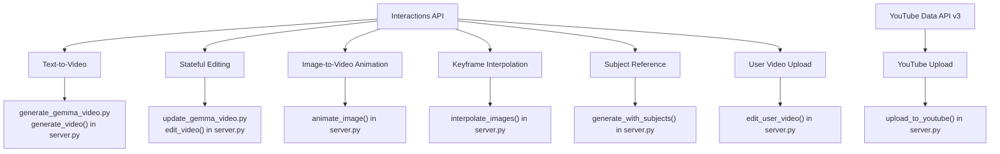

# ⚡ Gemini Omni Flash (`gemini-omni-flash-preview`) Reference & Cheat Sheet

Gemini Omni Flash is accessed exclusively via the **Interactions API** (`client.interactions.create`). It supports stateful, multi-turn video generation and editing.

---

## 🔗 Key API Links
* **Interactions API Overview:** [ai.google.dev/api/interactions-api](https://ai.google.dev/api/interactions-api)
* **Prompting Guide:** [deepmind.google/models/gemini-omni/prompt-guide](https://deepmind.google/models/gemini-omni/prompt-guide/)
* **Interactions Markdown Specification:** [ai.google.dev/api/interactions.md.txt](https://ai.google.dev/api/interactions.md.txt)

---

## 🔑 Essential API Parameters

When calling `client.interactions.create`, use the following parameter configurations:

| Parameter | Type | Description |
| :--- | :--- | :--- |
| **`model`** | `str` | Must be set to `"gemini-omni-flash-preview"`. |
| **`input`** | `str` \| `list` | Text prompt string, or a structured list containing text and image inputs. |
| **`previous_interaction_id`** | `str` | (Optional) ID of a prior interaction to perform stateful editing on that context. |
| **`response_modalities`** | `list[str]` | Set to `["video"]` (or `"video"` inside `response_format` depending on SDK version). |
| **`response_format`** | `dict` | Configure outputs. Format options include: <br>• `{"type": "video"}` (default aspect ratio: 16:9)<br>• `{"type": "video", "aspect_ratio": "9:16"}` (portrait)<br>• `{"type": "video", "delivery": "uri"}` (Google File API URI delivery for files > 4MB) |
| **`store`** | `bool` | Set to `True` if you plan to edit the output in subsequent turns (returns an `interaction_id`). |
| **`background`** | `bool` | Set to `False` for synchronous execution (typical for quick responses). |
| **`stream`** | `bool` | Set to `False` as streaming is not typically used for direct video outputs. |

---

## 💡 Prompting Best Practices for Cinematic Control

Gemini Omni Flash responds best to detailed cinematic descriptions:
1. **Scene Layout:** Describe the environment, subjects, clothing, and spatial arrangement.
2. **Subject Action:** Be specific about how subjects move (e.g., "The cat slowly sips its tea, lifting the warm mug with both paws").
3. **Camera & Motion:** Use camera vocabulary like *panning*, *tracking shot*, *crane shot*, *slow zoom*, or *cinematic close-up*.
4. **Lighting & Mood:** Specify lighting conditions (e.g., *volumetric lighting*, *golden hour*, *cyberpunk neon glow*, *moody shadows*).
5. **Style:** State the style clearly (e.g., *photorealistic 3D render*, *Pixar animation style*, *macro photography*, *flat design 2D vector*).

---

## 🛠 Project Implementation Mapping

These Interactions API patterns and auxiliary tools are implemented across the following files in this project:



### 📋 Detailed Implementation Details

* **Text-to-Video (`generate_video`):**
  Generates a new video from scratch. Supports landscape (16:9) or portrait (9:16) aspect ratios and can return video bytes inline or via Gemini File API `uri`.
  *See: [generate_gemma_video.py](file:///home/xbill/omni-flash-video-agent/generate_gemma_video.py) / [`generate_video` in server.py](file:///home/xbill/omni-flash-video-agent/server.py#L82-L111)*

* **Stateful Video Editing (`edit_video`):**
  Uses `previous_interaction_id` to refine an existing video session. Great for adding text overlays, modifying characters, or altering backgrounds while keeping the rest of the clip stable.
  *See: [update_gemma_video.py](file:///home/xbill/omni-flash-video-agent/update_gemma_video.py) / [`edit_video` in server.py](file:///home/xbill/omni-flash-video-agent/server.py#L113-L142)*

* **Image-to-Video Animation (`animate_image`):**
  Accepts a local image (JPEG/PNG/WebP converted to base64) alongside a motion prompt to bring a static image to life.
  *See: [`animate_image` in server.py](file:///home/xbill/omni-flash-video-agent/server.py#L144-L171)*

* **Interpolation between Keyframes (`interpolate_images`):**
  Accepts a start image and an end image, creating a smooth visual transition or timelapse (e.g. day to night).
  *See: [`interpolate_images` in server.py](file:///home/xbill/omni-flash-video-agent/server.py#L173-L204)*

* **Subject-based Video Generation (`generate_with_subjects`):**
  Injects one or more subject reference images (such as characters or items) into the video generation prompt to maintain identity consistency.
  *See: [`generate_with_subjects` in server.py](file:///home/xbill/omni-flash-video-agent/server.py#L206-L238)*

* **User Video Upload & Edit (`edit_user_video`):**
  Uploads any standard local MP4 video file to the Gemini File API and processes it with a natural language instruction to edit or stylize the video.
  *See: [`edit_user_video` in server.py](file:///home/xbill/omni-flash-video-agent/server.py#L240-L296)*

* **YouTube Upload (`upload_to_youtube`):**
  Authenticates via Google OAuth2 and uploads local video files directly to YouTube, supporting title, description, category, and privacy settings.
  *See: [`upload_to_youtube` in server.py](file:///home/xbill/omni-flash-video-agent/server.py#L299-L408)*

* **On-Demand Onboarding and Guide (`get_help`):**
  Provides prompting best practices, delivery modes, and details of all available MCP tools in the Gemini Omni Flash Video Agent.
  *See: [`get_help` in server.py](file:///home/xbill/omni-flash-video-agent/server.py#L411-L480)*

---

## 📡 REST API Structure

If communicating directly with the REST endpoints (without the Python/Node SDK), refer to the raw payload specs below. Note that the `interaction.output_video` field is an SDK convenience; in raw REST, outputs are returned in the `steps` array.

### Raw Request Example (Text-to-Video)
```bash
curl -X POST "https://generativelanguage.googleapis.com/v1beta/interactions?key=$API_KEY" \
-H "Content-Type: application/json" \
-H "Api-Revision: 2026-05-20" \
-d '{
 "model": "gemini-omni-flash-preview",
 "input": "A cinematic tracking shot of a mechanical butterfly flying through a cybernetic greenhouse.",
 "response_format": {
   "type": "video",
   "aspect_ratio": "16:9",
   "delivery": "inline"
 },
 "background": false,
 "store": true,
 "stream": false
}'
```

### Raw Response JSON Structure
```json
{
  "steps": [
    { "type": "user_input", "content": [{"type": "text", "text": "..."}] },
    { "type": "thought", "content": [{"text": "...", "type": "thought"}] },
    {
      "type": "model_output",
      "content": [
        {
          "type": "video",
          "mime_type": "video/mp4",
          "data": "AAAAIGZ0eXBpc29t..." // Base64 encoded video data (if inline)
        }
      ]
    }
  ],
  "id": "v1_interaction_id_12345",
  "status": "completed",
  "model": "gemini-omni-flash-preview",
  "object": "interaction"
}
```
