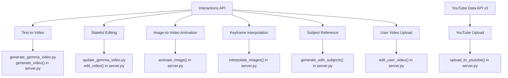

# 🤖 Gemini Omni Flash Video Agent

This repository contains tools, scripts, and a Model Context Protocol (MCP) server for interacting with **Gemini Omni Flash** (codenamed `gemini-omni-flash-preview`), Google's high-performance multimodal model designed for high-speed video generation, stateful editing, and cinematic control.

Unlike traditional video generation models, Gemini Omni Flash utilizes the stateful **Interactions API** (`client.interactions.create`), which allows you to iteratively edit and refine videos using natural language conversation within a single session.

**Project Repository:** [xbill9/omni-flash-video-agent](https://github.com/xbill9/omni-flash-video-agent)

---

## ✨ Features & Capabilities

- 🎥 **Text-to-Video:** Generate 10-second cinematic videos from detailed text prompts.
- 🎨 **Image-to-Video:** Animate static local images using descriptive motion prompts.
- 🔄 **Keyframe Interpolation:** Create smooth visual transitions (e.g., timelapses) between two distinct images.
- 👥 **Subject References:** Generate videos featuring specific characters or objects provided via local reference photos.
- ✍️ **Stateful Multi-turn Editing:** Edit previously generated videos iteratively while maintaining visual context.
- 📤 **User Video Editing:** Upload local videos using the Gemini File API to edit or stylize them using natural language.
- 📺 **YouTube Upload:** Upload generated or edited local videos directly to YouTube using OAuth2 credentials.

### 🗺️ System Implementation Mapping

The diagram below shows how the capabilities and APIs are mapped to the scripts and MCP tools in this repository:



---

## 🛠 Project Structure

- **[server.py](file:///home/xbill/omni-flash-video-agent/server.py)**: FastMCP server exposing high-level tools to AI agents for video creation, editing, and utility.
- **[generate_gemma_video.py](file:///home/xbill/omni-flash-video-agent/generate_gemma_video.py)**: Script demonstrating one-shot text-to-video generation.
- **[update_gemma_video.py](file:///home/xbill/omni-flash-video-agent/update_gemma_video.py)**: Script demonstrating stateful, multi-turn video editing using `previous_interaction_id`.
- **[test_agent.py](file:///home/xbill/omni-flash-video-agent/test_agent.py)**: Automated verification test suite validating file imports and server tool structures.
- **[init.sh](file:///home/xbill/omni-flash-video-agent/init.sh)**: Interactive onboarding shell script to configure Google Cloud project, store Gemini API key, and set up Application Default Credentials (ADC).
- **[set_env.sh](file:///home/xbill/omni-flash-video-agent/set_env.sh)**: Helper shell script to read and export Gemini/Google API credentials.
- **[omni.md](file:///home/xbill/omni-flash-video-agent/omni.md)**: Official documentation and REST specifications for Gemini Omni Flash.
- **[GEMINI.md](file:///home/xbill/omni-flash-video-agent/GEMINI.md)**: Cheat sheet and developer reference guide for the Interactions API.
- **[requirements.txt](file:///home/xbill/omni-flash-video-agent/requirements.txt)**: Python dependencies.

---

## 🚀 Getting Started

### Prerequisites & Setup

Ensure you have Python 3.10+ installed. Install the dependencies using pip:

```bash
pip install -r requirements.txt
```

Configure your credentials and environment variables (`GEMINI_API_KEY` and `GOOGLE_API_KEY`) by sourcing the setup script:

```bash
source set_env.sh
```
This will automatically check for your API key in `~/gemini.key`, prompt you if missing, export both `GEMINI_API_KEY` and `GOOGLE_API_KEY`, and dynamically update `.codex/config.toml` with the correct MCP server path and environment keys.


### Running the Scripts

#### 1. One-Shot Video Generation
To generate a video from a text prompt:
```bash
python generate_gemma_video.py
```
This saves the output video locally to `gemma_devops.mp4`.

#### 2. Multi-turn Video Editing (Stateful)
To generate an initial video and then statefully edit it (e.g., adding text overlays, modifying elements):
```bash
python update_gemma_video.py
```
This script will:
- Save the initial video to `gemma_devops_initial.mp4`
- Execute a stateful edit request using the initial video's `interaction_id`
- Save the updated video to `gemma_devops_updated.mp4`

---

## 🤖 Model Context Protocol (MCP) Server

The FastMCP server exposes Gemini Omni Flash's capabilities as tools, making them immediately consumable by AI assistants (such as Claude Desktop, Cursor, or Cline).

### Starting the Server in Development

You can run and interact with the server locally using the MCP CLI tool:
```bash
mcp dev server.py
```

### Config for MCP Clients

To integrate this server with your favorite desktop environment, configure your client settings file:

#### Claude Desktop Configuration
Add the following to your `claude_desktop_config.json`:

```json
{
  "mcpServers": {
    "omni-flash-video-agent": {
      "command": "python",
      "args": [
        "/absolute/path/to/omni-flash-video-agent/server.py"
      ],
      "env": {
        "GEMINI_API_KEY": "your-api-key-here"
      }
    }
  }
}
```

---

## 🛠 Exposed MCP Tools

The server registers the following high-level tools:

### 1. `generate_video`
Generates a 10s video from a text prompt.
- **Parameters:**
  - `prompt` (string, required): Text description of the desired video.
  - `aspect_ratio` (string, default: `"16:9"`): `"16:9"` (landscape) or `"9:16"` (portrait).
  - `delivery` (string, default: `"inline"`): `"inline"` (base64 bytes) or `"uri"` (downloads via File API).
- **Returns:** Path to the saved video file and the stateful `interaction_id`.

### 2. `edit_video`
Edits a previously generated video while maintaining visual consistency.
- **Parameters:**
  - `previous_interaction_id` (string, required): The ID of the preceding interaction session.
  - `edit_prompt` (string, required): Text description of the edit to make.
  - `delivery` (string, default: `"inline"`): `"inline"` or `"uri"`.

### 3. `animate_image`
Animates a static local image using a motion description.
- **Parameters:**
  - `image_path` (string, required): Absolute path to the local image file.
  - `motion_prompt` (string, required): Text guiding how the image should animate.
  - `delivery` (string, default: `"inline"`): `"inline"` or `"uri"`.

### 4. `interpolate_images`
Creates a smooth transition video between two local keyframe images.
- **Parameters:**
  - `start_image_path` (string, required): Path to the first image.
  - `end_image_path` (string, required): Path to the final image.
  - `prompt` (string, required): Description detailing the transition (e.g., sunset progression).
  - `delivery` (string, default: `"inline"`): `"inline"` or `"uri"`.

### 5. `generate_with_subjects`
Generates a video incorporating specific subjects/characters from local reference images.
- **Parameters:**
  - `subject_image_paths` (list of strings, required): List of local paths to subject images.
  - `prompt` (string, required): Description of the scene and subject actions.
  - `delivery` (string, default: `"inline"`): `"inline"` or `"uri"`.

### 6. `edit_user_video`
Uploads a local user video via the File API and edits it with Omni Flash.
- **Parameters:**
  - `video_path` (string, required): Absolute path to the local video file to upload and edit.
  - `edit_prompt` (string, required): Natural language description of what to change in the video.
  - `delivery` (string, default: `"inline"`): `"inline"` or `"uri"`.

### 7. `upload_to_youtube`
Uploads a local video file to YouTube.
- **Parameters:**
  - `video_path` (string, required): Absolute path to the local video file.
  - `title` (string, required): Title of the YouTube video.
  - `description` (string, required): Description of the video.
  - `category_id` (string, default: `"22"`): YouTube category ID.
  - `privacy_status` (string, default: `"private"`): `"private"`, `"public"`, or `"unlisted"`.

### 8. `get_help`
Utility tool providing a quick inline summary, cinematic prompting best practices, delivery modes guide, and key references for all available tools and parameters.

---

## 📦 Delivery Modes

- **`inline` (Default):** Returns video data embedded as base64 in the response. This is fast and convenient for small clips (< 4MB).
- **`uri` (Recommended):** Delivers large files via the Google File API URI. The server polls until the file status is `ACTIVE` and downloads it directly. Use this to avoid hitting payload size limit constraints on larger generations.

---

## 🧪 Running Verification & Tests

To verify module imports and validate that all MCP server tools are correctly defined in `server.py`, run the automated test suite:

```bash
python -m unittest test_agent.py
```
